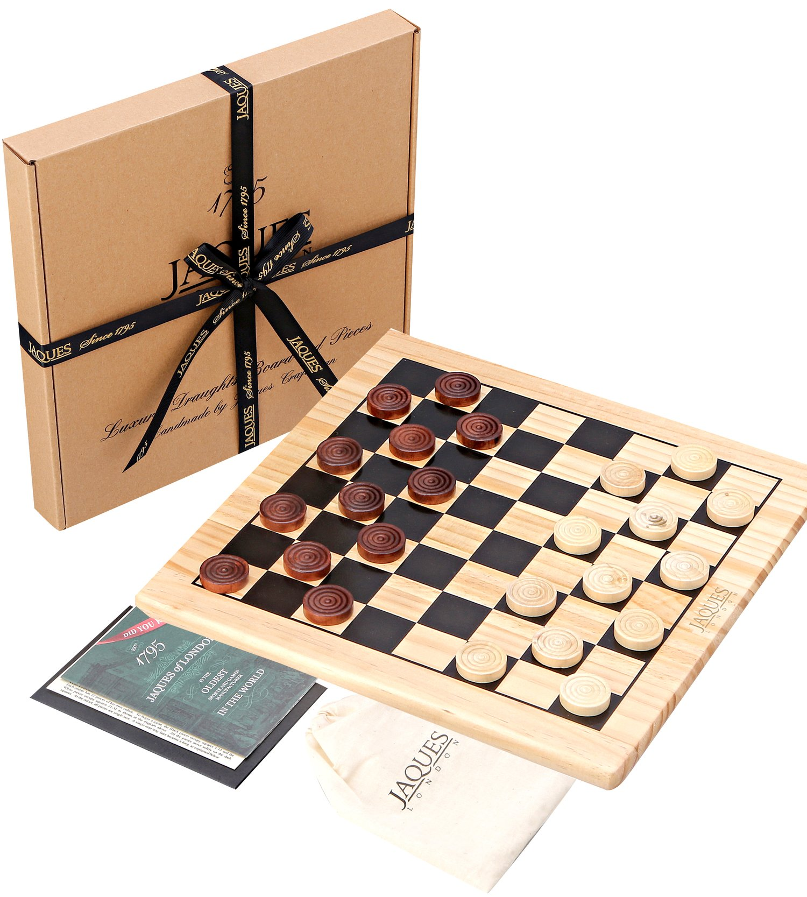

# Draughts

Draughts scores

- [Site](https://alexhedley.github.io/draughts/)

---

[Buy](https://www.jaqueslondon.co.uk/collections/draughts/products/draughts-set-12-wooden-draughts-board-game-with-pieces-jaques-of-london)

## Description

This Wooden Draughts set has been lovingly designed and manufactured by an established family games company spanning over 220 years.

This Draughts Set includes: 1 x 12” Wooden Playing Board, 16 x Wooden White Draughts Pieces, 16 x Wooden Brown Draughts Pieces.

Premium quality – solid wooden playing board with top quality wooden playing pieces.

Family fun – Draughts is a traditional and much-loved game. Suitable for adults and children alike, this board game provides the perfect opportunity for screen-free fun.

Rules of Draughts:

THE PLAY Black moves first, and thereafter the players move alternately.

A player loses the game if he cannot move in turn; usually this is because all his pieces have been captured, but it can also come about because all his remaining pieces are immobilised.

Many games are drawn by agreement, when few pieces remain and neither player has an advantage sufficient to win.

NONCAPTURING MOVE: A single man may move forward only on the dark diagonal, one square at a time (when not capturing).

CAPTURING MOVE: The capturing move is a jump. If a White piece stands adjacent and forward to a Black piece, and if the square back of the White piece on the same line is vacant, the Black piece jumps over it to the vacant square, and then the White piece is removed from the board. If a piece makes a capture, and then is on a square from which it can jump over another adverse piece, it continues jumping in the same turn. It may change direction during a series of jumps. It sometimes happens that a piece may capture in either of two directions, or either of two pieces may make a capture. In all such situations, the owner has a free choice.

 CROWNING: The row of squares farthest from the player is his king row. On reaching the king row, a single man is crowned and becomes a king. The opponent must immediately put on top of it another piece of the same colour, and the two draughts are then moved as a unit. The king has the same powers as a single man, plus the right to move backward as well as forward. Moves in both directions may be combined in one series of jumps.
